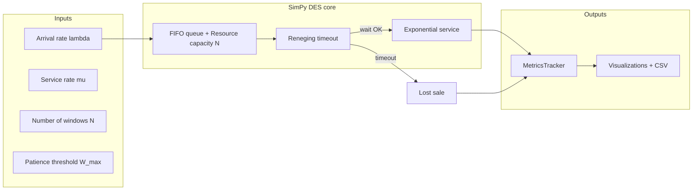

# Reducing Customer Wait Time and Lost Sales at a Fast-Food Drive-Through

**Course context:** System Simulation and Modeling (SSM) — Discrete-Event Simulation (DES) mini project.

This repository implements a modular **drive-through** model using **SimPy** with **Poisson arrivals** (exponential inter-arrivals), **FIFO** queue discipline, **exponential service times**, optional **customer reneging** after a configurable waiting threshold (lost sales / lost revenue), and **multi-server** configurations (1, 2, and 3 windows). **Peak-hour** traffic is modeled as a higher arrival rate for direct comparison with normal demand.

---

## Project overview

Customers arrive randomly, join a single FIFO lane, wait for one of `N` identical parallel servers (windows), receive service (order + payment + pickup abstracted as one service block), and exit. If queue waiting exceeds a patience threshold, the customer **reneges** — a **lost sale** with estimated **lost revenue**.

**Key performance indicators (KPIs):**

| KPI | Description |
| --- | --- |
| Average waiting time | Mean time from arrival until service starts |
| Time-average queue length | \(\bar L\): integral of queue length over simulation horizon |
| Throughput | Completed customers per hour |
| Server utilization | Busy service time / (`N` × horizon) |
| Lost customers | Reneged customers (excessive wait) |
| Lost revenue | Lost customers × average ticket price |

---

## Folder structure

```
project/
  app.py              # Streamlit web dashboard
  main.py             # CLI, scenario orchestration, CSV export
  scenario_runner.py  # Shared batch of scenarios (CLI + web)
  simulation.py       # DriveThroughSystem + SimPy processes
  queue_manager.py    # FIFO bookkeeping + time-average queue length
  customer.py         # Customer entity + factory
  metrics.py          # ScenarioResult, MetricsTracker, CSV helpers
  visualization.py    # Matplotlib figures (saved under outputs/)
  config.py           # Central parameters (rates, horizon, economics)
  requirements.txt
  README.md
  outputs/            # Created on run: PNG figures + scenario_results.csv
```

---

## Installation

**Prerequisites:** Python 3.10+ recommended (tested on 3.14).

```powershell
cd path\to\project
python -m venv .venv
.\.venv\Scripts\Activate.ps1
pip install -r requirements.txt
```

**Libraries:** `simpy`, `numpy`, `matplotlib`, `pandas`, `streamlit` (see `requirements.txt`).

---

## Run as a website (recommended for demos)

Starts a local web app in your browser (tables + charts + CSV download):

```powershell
cd c:\Users\SAHANA\OneDrive\Desktop\ssm\project
python -m pip install -r requirements.txt
python -m streamlit run app.py
```

If `python` is not found, try `py -m pip install ...` and `py -m streamlit run app.py` instead.

**Note:** On Windows, `streamlit` alone may not be recognized (Scripts folder not on PATH). Using `python -m streamlit` avoids that.

Streamlit prints a URL such as `http://localhost:8501`. Use the **sidebar** to change arrival rates, horizon, reneging threshold, etc., then click **Run simulation**.

---

## How to run (command line)

**Default 8-hour horizon (480 minutes), seed 42, figures saved to `outputs/`:**

```powershell
python main.py
```

**Faster classroom demo (shorter horizon):**

```powershell
python main.py --duration 120
```

**Custom random seed:**

```powershell
python main.py --seed 7
```

**Try to open interactive figure windows after saving:**

```powershell
python main.py --show
```

On lab machines without a display, set `MPLBACKEND=Agg` before running so Matplotlib can still save PNG files.

---

## Configurable parameters

Edit `SimulationConfig` in `config.py` (or extend `main.py` to load from JSON/CLI if you wish):

| Parameter | Meaning |
| --- | --- |
| `simulation_duration` | Clock horizon (minutes) |
| `normal_arrival_rate` / `peak_arrival_rate` | Poisson rates (customers per minute) |
| `service_rate` | Exponential service rate (1 / mean service minutes) |
| `max_wait_before_renege` | Reneging threshold (minutes waiting for a window) |
| `average_ticket_price` | Used to estimate lost revenue |
| `random_seed` | Reproducibility (`None` for nondeterministic) |

---

## Generated artifacts

After `python main.py`, check `outputs/`:

| File | Purpose |
| --- | --- |
| `scenario_results.csv` | All scenarios in one table (Excel-friendly) |
| `fig1_waiting_vs_servers.png` | Waiting time vs number of servers (normal traffic) |
| `fig2_queue_length.png` | Queue length dynamics (1 vs 3 windows, normal traffic) |
| `fig3_lost_customers.png` | Lost customers by scenario |
| `fig4_throughput.png` | Throughput (customers/hour) by scenario |
| `fig5_peak_hour_waiting.png` | Normal vs peak average wait, matched server counts |

**Interpreting the graphs**

1. **Waiting vs servers:** Shows congestion relief as parallel windows increase (under identical arrival parameters).
2. **Queue length:** Visualizes buildup and draining of the FIFO lane; higher peaks imply higher customer risk and stress on operations.
3. **Lost customers:** Highlights sensitivity to staffing when demand spikes or when `max_wait_before_renege` is tight.
4. **Throughput:** Completed sales per hour; compares capacity across scenarios.
5. **Peak hour:** Contrasts the same staffing layout under normal vs elevated arrival rates.

---

## Sample console output (illustrative)

Exact numbers depend on seed and horizon; one representative run:

```
=== Scenario KPI Summary ===

scenario_name  num_servers arrival_mode  completed_customers  lost_customers  average_waiting_time  ...
    normal_1S            1       normal                  161              13                 1.778  ...
    normal_2S            2       normal                  174               0                 0.184  ...
    normal_3S            3       normal                  173               0                 0.040  ...
      peak_1S            1         peak                  222             175                 5.515  ...
      peak_2S            2         peak                  373              33                 2.308  ...
      peak_3S            3         peak                  405               0                 0.492  ...
```

CSV mirrors this table without embedded timeline columns.

---

## System architecture (conceptual)



**ASCII deployment view**

```
  [Arrival generator] ---> [FIFO lane / queue metrics]
                                |
                                v
                     [SimPy Resource: N windows]
                                |
                +---------------+---------------+
                |                               |
         [Service: Exp(mu)]                [Reneging: if wait > W_max]
                |                               |
                v                               v
           [Completed]                      [Lost customer]
                \_______________________________/
                                |
                         [Metrics + plots]
```

---

## Event flow (narrative)

1. **Arrival event:** Scheduled after an exponential inter-arrival time (Poisson process).
2. **Queue entry:** Customer joins the FIFO lane; queue-length integrator advances.
3. **Seize window:** Customer requests one of `N` identical servers (SimPy `Resource`).
4. **Reneging check:** Simultaneous wait on `request | timeout(W_max)`. If timeout wins first, the customer abandons (lost sale).
5. **Service:** Exponential service duration; server busy time accrues for utilization.
6. **Departure:** Customer exits; throughput and waiting-time statistics update.

---

## Algorithm steps (per replication)

1. Initialize SimPy `Environment`, `Resource(capacity=N)`, RNG seed.
2. Start arrival process: repeat until horizon:
   - Sample `T ~ Exponential(1/λ)`
   - If `now + T` exceeds horizon, stop; else advance clock by `T` and spawn a customer process.
3. For each customer:
   - Record arrival; enqueue (metrics + queue integrator).
   - `yield (resource.request() | timeout(W_max))`
   - If timeout triggers first: mark lost, update lost revenue counter, stop process.
   - Else: record waiting time; hold server for `S ~ Exponential(mean=1/μ)`; record completion and service minutes.
4. At end of horizon: compute time-average queue length, utilization, throughput, export CSV, render plots.

---

## Modeling assumptions (for your report)

- **Single merged stage** per window (order, pay, pickup combined) keeps the model compact and standard for M/M/c-style teaching extensions.
- **Homogeneous servers** with identical exponential service distributions.
- **Infinite population** of potential customers ( arrivals not constrained by population size ).
- **Reneging** depends only on **queue waiting** for a window, not on balking at the street entrance.

---

## Extending the project (ideas)

- Split **order / pay / pickup** into a tandem network with buffers.
- Add **time-varying arrival rates** (piecewise λ(t)) for lunch vs dinner ramps.
- Run **multiple replications** and report confidence intervals on mean wait.

---

## References (typical DES / queueing citations for reports)

- Banks et al., *Discrete-Event System Simulation* (classic DES text).
- Law, *Simulation Modeling and Analysis* (output analysis, replications).
- SimPy documentation: https://simpy.readthedocs.io/

---

## License / academic use

Created for educational demonstration. Adapt freely for coursework with appropriate citation of your source code and assumptions.
